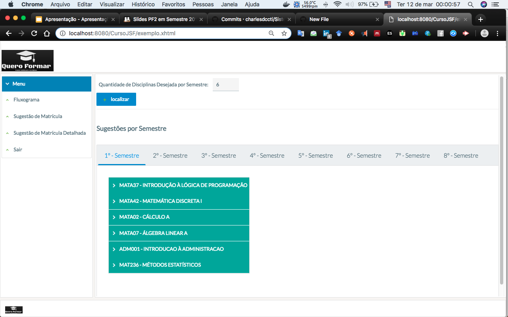

# Sistema_QueroFormar_UFBA

### Técnicas de Inteligência Artificial Implementadas:
- Algoritmos de Busca Gulosa
- Redes Neurais Artificias 

## Projeto para disciplina de Inteligência Artificial 2018.1

1. [Slides da Apresetação do QueroFormar](slides.pdf)

### Visualização da opção "Sugestão de Matrícula Detalhada" após fazer login:

